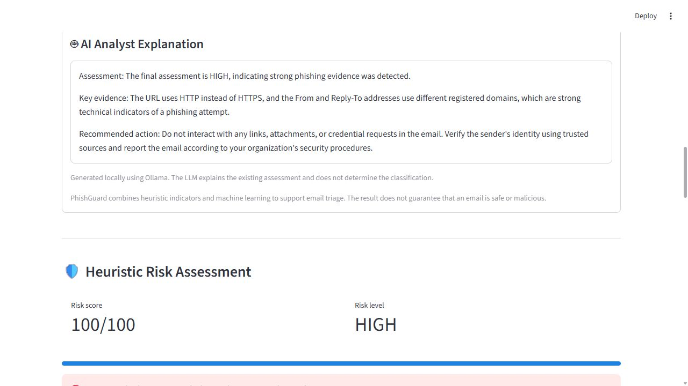
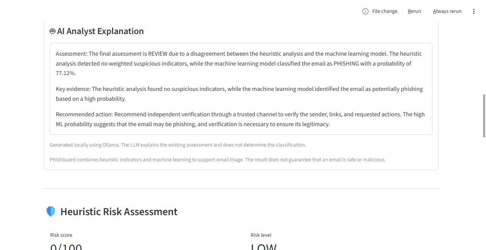
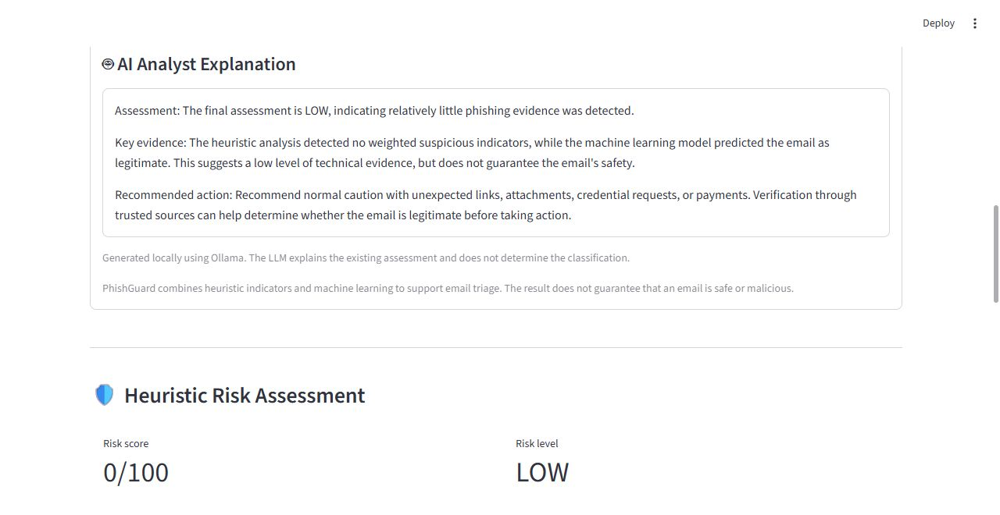
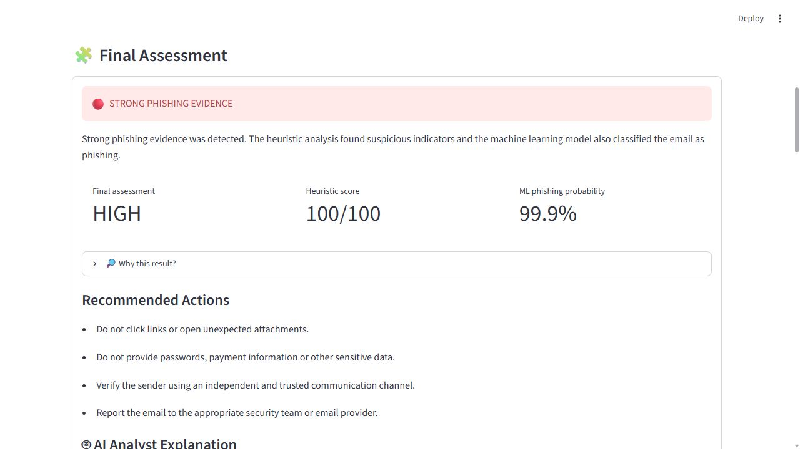
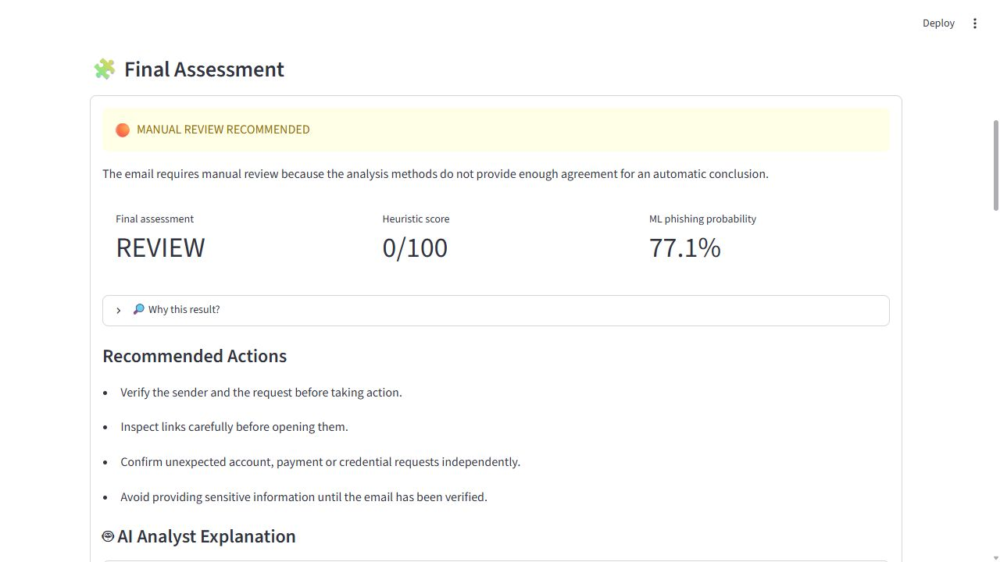
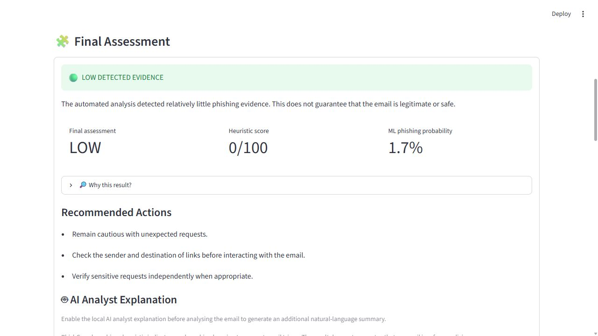

# PhishGuard

**English** | [Português (Portugal)](README_pt-pt.md)

A cybersecurity portfolio project for email triage: explainable heuristics, a TF-IDF + Logistic Regression classifier, a hybrid decision engine, and optional local Ollama analyst explanations. Developed to demonstrate technical investigation and evaluation skills relevant to cybersecurity and SOC roles.

## How it works

```text
Raw email (text or .eml)
    -> Email parser
    -> URL + language + header indicators -> Heuristic score
    -> Email body -> TF-IDF + Logistic Regression -> ML prediction
    -> Hybrid engine -> HIGH / REVIEW / LOW
    -> Deterministic explanation and recommended actions
    -> Optional local LLM explanation (does not classify)
```

The heuristic score is capped at 100. Each indicator type is counted once per source. Scores below 30 are LOW, 30–59 are MEDIUM, and 60–100 are HIGH. These are heuristic points, not probabilities.

The ML classifier uses the extracted body and a phishing threshold of **0.50**. Its predicted probability is a model output, not a guarantee or a calibrated measure of real-world risk.

| Heuristic result | ML prediction | Final assessment |
| --- | --- | --- |
| MEDIUM or HIGH | PHISHING | HIGH |
| LOW | LEGITIMATE | LOW |
| Other combinations | Either | REVIEW |

REVIEW means the methods disagree. LOW means low detected evidence; it does not establish that the email is safe. If the trained model is missing, heuristic analysis remains available but the hybrid assessment is unavailable.

## Features

- Paste raw email or upload `.eml` text/bytes, including multipart plain-text and HTML bodies.
- Extract sender, Reply-To, Return-Path and Authentication-Results headers.
- Detect domain mismatches and supplied SPF, DKIM and DMARC outcomes.
- Identify HTTP URLs, IP address destinations, shorteners, Punycode and selected TLD indicators.
- Detect common English urgency, threat, credential and payment language.
- Show heuristic evidence, ML prediction, hybrid assessment and recommended actions.
- Optionally explain the existing result through local Ollama (`qwen2.5:3b`). Only structured analysis results are sent; the raw email body is not sent to the LLM.

## Technical detection pipeline

### 1. Email parsing and evidence extraction

[`src/email_parser.py`](src/email_parser.py) uses Python's `email` package with `policy.default`: `Parser` for pasted strings and `BytesParser` for uploaded `.eml` bytes. It extracts From, To, Subject, Reply-To, Return-Path and all Authentication-Results headers. For multipart messages it prefers `text/plain`, falling back to `text/html`; BeautifulSoup converts HTML into visible text.

Two different text inputs are intentional: the language analyzer receives **subject + body**, while the ML classifier receives **body only**, matching the body-based training pipeline. Header and URL evidence remains a separate heuristic signal.

### 2. Header and authentication analysis

[`src/header_analyzer.py`](src/header_analyzer.py) extracts addresses with `email.utils.parseaddr` and uses `tldextract` to compare registered domains rather than complete hostnames. For example, `security.example.com` and `mail.example.com` share the registered domain `example.com`; a Reply-To at a different registered domain raises a mismatch indicator.

SPF normally evaluates whether a sending host is authorised for the envelope sender domain. DKIM verifies a domain signature over signed message content and headers. DMARC uses SPF/DKIM outcomes and alignment with the visible From domain. **PhishGuard does not execute these protocols:** it parses the outcomes already present in Authentication-Results using a case-insensitive regular expression. Establishing the trustworthiness of those headers requires the receiving mail system's trust boundary.

| Indicator | Points | Behaviour |
| --- | ---: | --- |
| Missing or invalid sender domain | 10 | Sender extraction produced no domain |
| From / Reply-To mismatch | 15 | Registered domains differ |
| From / Return-Path mismatch | 5 | Registered domains differ; legitimate forwarding can also cause this |
| SPF fail or softfail | 15 | Supplied authentication result indicates failure |
| DKIM fail | 15 | Supplied authentication result indicates failure |
| DMARC fail | 25 | Supplied authentication result indicates failure |
| neutral, none, temperror or permerror | 3 per protocol | Low-weight inconclusive result |

A mismatch is evidence for review, not proof of impersonation. Mailing lists, third-party senders and forwarding can create legitimate differences. Authentication passing also does not prove an email's content is benign.

### 3. URL analysis

[`src/url_analyzer.py`](src/url_analyzer.py) extracts HTTP/HTTPS strings from the readable body, strips common trailing punctuation and parses them with `urllib.parse.urlparse`. `ipaddress` recognises raw IP destinations and `tldextract` identifies registered domains and suffixes. Malformed URLs are tolerated so a single malformed value does not crash the analysis.

| Signal | Points | Detection method |
| --- | ---: | --- |
| HTTP | 10 | URL scheme is `http` |
| IP destination | 25 | Hostname is a valid IPv4 or IPv6 address |
| URL shortener | 15 | Registered domain matches a configured set, e.g. `bit.ly` |
| Punycode | 25 | Hostname contains `xn--` |
| Selected TLD | 10 | Suffix matches a configured set, e.g. `xyz`, `top` or `click` |

These checks examine URL syntax and configured lists. There is no live reputation service, DNS investigation, redirect following or website content retrieval. HTTP, internationalised domains and selected TLDs can occur in legitimate email; they are weighted signals rather than standalone verdicts.

### 4. Social engineering analysis

[`src/keyword_analyzer.py`](src/keyword_analyzer.py) runs case-insensitive regular expressions with word boundaries against the subject and body. It groups matching phrases into categories and returns the matched text for inspection.

| Category | Points | Example matching phrases |
| --- | ---: | --- |
| Urgency | 10 | `urgent`, `immediately`, `within 24 hours` |
| Threat | 10 | `account has been suspended`, `failure to verify` |
| Credential request | 20 | `verify your identity`, `enter your password`, `login` |
| Financial request | 20 | `bank details`, `wire transfer`, `credit card` |
| Call to action | 5 | `click here`, `open the attachment` |

Each category contributes once, even when several phrases match. Legitimate security or finance messages can use the same language; interpreting these matches alongside other evidence reduces reliance on wording alone.

### 5. Explainable heuristic scoring

[`src/risk_engine.py`](src/risk_engine.py) sums configured weights with deduplication by `(source, indicator type)`. Repeating the same HTTP indicator across several URLs does not increase its weight. The engine returns `raw_score`, capped `score`, `level`, and a `breakdown` with source, message and points for each contribution.

```text
raw_score = sum(weights of unique indicators per source)
score = min(raw_score, 100)
LOW: 0–29 | MEDIUM: 30–59 | HIGH: 60–100
```

The weights and cut-offs are hand-selected heuristic choices, not fitted or calibrated probabilities. The breakdown allows an analyst to explain why an alert was raised and to discuss false-positive causes.

### 6. Machine learning classification

[`training/train_model.py`](training/train_model.py) removes missing bodies/labels and exact duplicate bodies, converts labels to integers, then performs an 80/20 stratified train/test split with `random_state=42`.

The scikit-learn `Pipeline` fits the vectorizer and classifier on the training data:

- **TF-IDF:** lowercase text; word unigrams and bigrams; up to 50,000 features; `min_df=2`; `max_df=0.98`; sublinear term frequency. This represents words and short phrases by their frequency relative to the training corpus.
- **Logistic Regression:** `max_iter=1000`, `random_state=42`. It learns a linear boundary over the TF-IDF features and exposes class probabilities through `predict_proba`.
- **Inference:** [`src/ml_classifier.py`](src/ml_classifier.py) finds class `1` in `model.classes_`, obtains its probability and predicts PHISHING when `p >= 0.50`.
- **Persistence:** joblib stores the complete pipeline. `app.py` caches the loaded model with `st.cache_resource`.

The classifier can detect learned text patterns beyond the explicit keyword list, but it cannot authenticate a sender or determine a URL's reputation. Exact-body deduplication reduces one leakage source; it does not establish that near-duplicates or related templates are absent. External evaluation is therefore essential.

### 7. Hybrid assessment and deterministic explanation

[`src/hybrid_engine.py`](src/hybrid_engine.py) applies the decision table above rather than averaging the heuristic points with the ML probability. This preserves the meaning of both signals and makes disagreement explicit. [`src/explanation_engine.py`](src/explanation_engine.py) creates the summary, evidence and recommended actions from that already determined result.

The purchase example illustrates why this matters: the heuristic engine returns `0/100`, while the trained model predicts PHISHING with approximately `77.1%` probability. The final result is **REVIEW**, allowing a person to investigate the conflict instead of treating either method as definitive.

## Local LLM: analyst explanation after classification

[`src/llm_explainer.py`](src/llm_explainer.py) adds a natural-language explanation through **Ollama + Qwen2.5 3B**. The LLM has no role in setting the score, ML probability or final assessment. Its purpose is to turn the existing evidence into an analyst-style summary and next steps.

```text
Heuristic result + ML result
        -> Hybrid assessment (Python rules)
        -> Structured context and explicit agreement/disagreement
        -> Constrained prompt
        -> Local Ollama POST /api/generate
        -> Assessment / Key evidence / Recommended action
```

### Data sent to the LLM

`build_llm_context()` creates JSON containing the final assessment, analysis relationship, review reason, heuristic score and level, ML prediction and probability, and the weighted evidence breakdown. The probability in this context is expressed as a percentage, rounded to two decimals.

Illustrative context for the purchase case:

```json
{
  "final_assessment": "REVIEW",
  "analysis_relationship": "DISAGREEMENT",
  "review_reason": "The heuristic analysis detected low phishing risk, while the machine learning model classified the email as PHISHING with a probability of 77.12%.",
  "heuristic_score": 0,
  "heuristic_level": "LOW",
  "ml_prediction": "PHISHING",
  "ml_phishing_probability": 77.12,
  "evidence": []
}
```

The raw email body is excluded. This reduces exposure to email-authored instructions and unnecessary email content; it does not prove immunity to prompt injection or make all structured context non-sensitive. The local deployment avoids sending this explanation request to a hosted LLM service.

### Prompt controls and generation settings

`build_prompt()` tells the model that the classification is already determined and requires three sections: **Assessment**, **Key evidence**, and **Recommended action**. It instructs the model to preserve the decision, use only supplied evidence, avoid inventing scores or certainty, explain disagreement in REVIEW cases, and avoid exposing internal indicator names. Technical authentication and sender evidence is prioritised before language cues.

`generate_llm_explanation()` sends a JSON request to `http://localhost:11434/api/generate` with:

| Setting | Value | Purpose |
| --- | --- | --- |
| Model | `qwen2.5:3b` | Local explanation model |
| Temperature | `0.2` | Encourage relatively consistent wording |
| Token budget | `num_predict=220` | Limit explanation length |
| Streaming | `false` | Receive one complete response |
| Keep alive | `10m` | Keep the model loaded between requests |
| Timeout | `120` seconds | Bound the wait for the optional explanation |

These are prompt instructions and generation settings, not guaranteed output enforcement. A low temperature does not make an LLM fully deterministic. The code checks for an empty response, but does not validate every factual claim or force the output into a parsed schema. The application displays connection/timeout errors while preserving the existing detection results.

### What is tested

The LLM tests verify the structured context, agreement/disagreement, explicit review reason, prompt constraints, appropriate actions and exclusion of the raw email. They do **not** prove that every live model response follows the prompt. The screenshots below are observed example responses, not a quality benchmark of the LLM.

### Live LLM examples

These additional screenshots focus on the generated explanation rather than only the score. The original HIGH / REVIEW / LOW screenshots remain in the Screenshots section.

**HIGH — explanation of detected technical indicators and escalation advice**



**REVIEW — explicit heuristic/ML disagreement and the 77.12% model output**



**LOW — little detected evidence without claiming the email is safe**



This observed LOW response preserves the assessment, mentions agreement between the methods and explicitly states that low evidence does not guarantee safety.

**Observed limitation:** in this REVIEW response, the model correctly explains the disagreement but uses the phrase “ensure its legitimacy”. That wording is too confident and conflicts with the prompt's instructions. The HIGH response also omits authentication failures despite their prompt priority. These observed examples illustrate why prompt constraints are not equivalent to output validation. The final assessment and numerical scores are computed independently and are unaffected by generated wording. A future improvement is programmatic validation with a deterministic fallback when generated explanations introduce unsupported certainty.

## Portfolio relevance: cybersecurity and SOC triage

This project demonstrates Python evidence extraction, email-authentication concepts, URL/domain analysis, explainable alert scoring, supervised text classification, external validation and cautious use of a local LLM in an analyst workflow.

An analyst can use the output to document why a message is suspicious, separate technical evidence from text-model predictions, identify disagreements, and decide what needs independent verification or escalation. HIGH supports investigation and reporting; REVIEW exposes conflicting signals; LOW preserves caution when little evidence is detected. The app does not execute quarantine, remediation or reporting actions.

Interview topics supported by the implementation include:

- Why compare registered domains, and why can Return-Path legitimately differ from From?
- Why do passing SPF/DKIM/DMARC results not guarantee benign content?
- Why keep heuristic scores separate from ML probabilities?
- What explains strong internal metrics and weaker external performance?
- How do false negatives, false positives and manual-review coverage affect SOC workload?
- Why exclude raw email from the LLM context, and what still needs output validation?

Possible next steps are extracting HTML link destinations, establishing trusted authentication-header provenance, pinning dependencies and dataset versions, improving evaluation splits and calibration, and validating LLM output against the supplied evidence. SIEM integration, attachment scanning and automated response are future work, not implemented capabilities.

## Run locally (Windows / PowerShell)

Python 3.12 is required. From the repository root, only three commands are needed:

```powershell
py -3.12 -m venv .venv
.\.venv\Scripts\python.exe -m pip install -r requirements.txt
.\.venv\Scripts\python.exe -m streamlit run app.py
```

No environment activation or PowerShell execution-policy change is needed. On subsequent runs, use only the last command. VS Code is optional.

| Mode | Requirements | Available features |
| --- | --- | --- |
| Heuristics | The installation above | Header, URL, language and risk analysis |
| ML / hybrid | A locally trained `models/phishing_model.joblib` | ML probability and HIGH / REVIEW / LOW assessment |
| Local LLM | ML model plus Ollama and `qwen2.5:3b` | Optional explanation after classification |

For ML, provide `data/raw/Balanced_Dataset.csv` with `body` and `label` (0 legitimate, 1 phishing), then run `.\.venv\Scripts\python.exe -m training.train_model`. This writes the model and replaces the training metrics report. Load only trusted joblib files with compatible dependency versions.

For LLM explanations, install Ollama separately, run `ollama pull qwen2.5:3b`, keep the local service running and enable “Generate local AI analyst explanation” in the app. Ollama is optional and does not classify emails.

See the [concise setup guide](PhishGuard_SETUP.md) for test commands and troubleshooting, and [dataset inputs and provenance](docs/DATASETS.md) for reproduction requirements. Dataset sources, publisher-declared licences and file identities are documented and verified; the repository does not distribute datasets or a pretrained model. The pinned requirements record the working environment reviewed here, not proof of the environment behind every historical benchmark.

## Screenshots

The screenshot scenarios are PayPal phishing (HIGH), the legitimate purchase challenge case with ML/heuristic disagreement (REVIEW), and a normal meeting reminder (LOW).

The three scenarios were also verified using Streamlit AppTest with the local trained model: HIGH = 100/100 and 99.9% ML probability; REVIEW = 0/100 and 77.1%; LOW = 0/100 and 1.7%. The original LOW summary screenshot uses the deterministic explanation. Additional local Ollama explanations were generated for HIGH, REVIEW and LOW; see the Live LLM examples section.

### HIGH — PayPal phishing



### REVIEW — legitimate purchase / model disagreement



### LOW — normal meeting reminder



## Recorded evaluation results

The following values come from the committed reports in `results/`. They are recorded evaluation results, not a benchmark rerun on 7 October 2026.

| Evaluation | Samples | Accuracy | Precision | Recall | F1 |
| --- | ---: | ---: | ---: | ---: | ---: |
| Internal ML test split | 39,008 | 98.05% | 97.74% | 98.45% | 98.09% |
| External validation, full | 2,000 | 80.05% | 75.19% | 89.70% | 81.81% |
| External validation, deduplicated | 100 | 78.00% | 51.16% | 95.65% | 66.67% |
| E-PhishGen English, ML | 11,502 | 68.74% | 76.61% | 57.62% | 65.77% |

The external validation set contains 1,900 duplicate rows out of 2,000 and only 100 unique emails. The deduplicated result is therefore the more informative comparison. The difference from the internal test split shows substantial dataset sensitivity.

### Threshold analysis (100 unique external-validation emails)

| Threshold | Accuracy | Precision | Recall | F1 |
| --- | ---: | ---: | ---: | ---: |
| 0.30 | 71% | 44.23% | 100% | 61.33% |
| 0.40 | 74% | 46.94% | 100% | 63.89% |
| 0.50 (current default) | **78%** | 51.16% | 95.65% | 66.67% |
| 0.60 | 79% | 52.38% | 95.65% | 67.69% |
| 0.75 | 81% | 55.00% | 95.65% | 69.84% |
| 0.85 | 84% | 60.00% | 91.30% | 72.41% |
| 0.90 | 87% | 66.67% | 86.96% | 75.47% |

Increasing the threshold trades recall for fewer false positives. These observations do not establish an optimal production threshold.

### Hybrid evaluation

On the 12-case synthetic challenge set, the hybrid engine decided 6 cases, reviewed 6, and was correct on all 6 decided cases. This is a small illustrative set, not evidence of 100% general accuracy.

On the 11,502-email E-PhishGen English benchmark, the hybrid engine decided 8,131 cases (70.69% coverage), sent 3,371 to REVIEW (29.31%), and achieved 70.35% accuracy among decided cases. It recorded 1 false positive and 2,410 false negatives among decided cases. The benchmark is content-based and does not provide original authentication headers. Review cases are excluded from decision accuracy; this metric is not directly comparable to ordinary ML accuracy over every sample.

See [ML metrics](results/ml_metrics.json), [external validation](results/external_validation_metrics.json), [threshold analysis](results/threshold_analysis.csv), [challenge summary](results/hybrid_challenge_summary.json), and [final benchmark](results/final_benchmark_summary.json).

## Tests

```powershell
.\.venv\Scripts\python.exe -m pip install -r requirements-dev.txt
.\.venv\Scripts\python.exe -m pytest
```

Final review on 8 October 2026: **55 tests passed in 8.27 seconds with a fresh dependency installation** in a copy without datasets, a trained model or Ollama. Coverage includes parsing, headers, URLs, language, risk, hybrid decisions, ML inference boundaries, explanations and Streamlit. `pytest.ini` configures normal collection; the GitHub workflow runs the same suite on Python 3.12.

In this restricted environment, numerical imports required the following terminal settings:

```powershell
$env:OPENBLAS_NUM_THREADS = '1'
$env:OMP_NUM_THREADS = '1'
.\.venv\Scripts\python.exe -m pytest -q -p no:cacheprovider
```

These settings apply only to that terminal session. The historical benchmarks were not rerun during this review.

## Repository layout

```text
app.py                 Streamlit interface
src/                   Parsing, analyzers, ML, risk, hybrid and explanations
tests/                 Unit and Streamlit tests
training/              Training, validation and evaluation scripts
samples/               Synthetic example .eml files
results/               Recorded evaluation reports
docs/screenshots/      Application screenshots
requirements*.txt      Pinned runtime / test dependencies
.github/workflows/     Automated tests
data/                  Local datasets (ignored)
models/                Local trained model files (ignored)
```

## Limitations

- This is a portfolio triage tool, not a production email gateway or a definitive phishing detector.
- The parser reads supplied authentication outcomes; it does not independently verify SPF, DKIM or DMARC. Untrusted headers can be forged, and repeated results currently collapse into one result per protocol.
- Heuristics focus on English phrases and a small indicator list. Unseen wording and sophisticated attacks may evade detection.
- HTML is converted to visible text; hidden link destinations may be lost. Attachments are not scanned, shortened links are not resolved, and linked pages are not visited.
- Content-only ML can confuse legitimate transactional language with phishing. Reported probabilities are not validated as calibrated confidence.
- The hybrid engine can still miss phishing; REVIEW requires human investigation.
- The LLM receives a constrained prompt but its generated text is not programmatically checked for every unsupported statement.
- Evaluation reports do not prove performance on a different organisation, language or future attack distribution.
- Direct dependencies and the numerical ML stack are pinned. Full reproduction still requires the original training environment; transitive dependencies are not fully locked.

The per-sample evaluation CSVs publish local sample IDs, labels and predictions without source email bodies or subjects. Previously committed versions may still contain text in Git history; see [DATASETS.md](docs/DATASETS.md).

## Git hygiene

`.gitignore` excludes `data/` (including `data/raw/`), `.venv/`, Python caches, trained `.joblib`/`.pkl` files, Streamlit secrets and local environment/credential files. Keep real private emails and credentials out of `samples/`, screenshots and reports.

## License

Original project code and documentation: **Apache-2.0**, see [LICENSE](LICENSE) and [NOTICE](NOTICE). Third-party datasets, libraries and models retain their own licences; see [dataset attribution](docs/DATASETS.md). Earlier MIT releases retain the permissions already granted.
